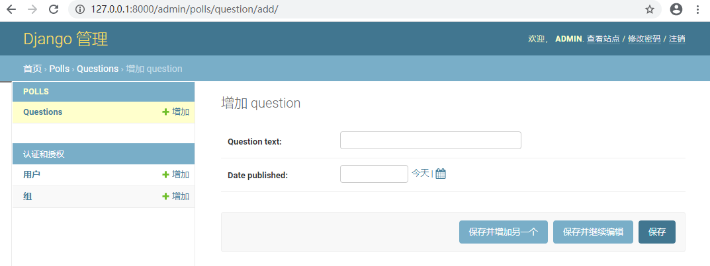
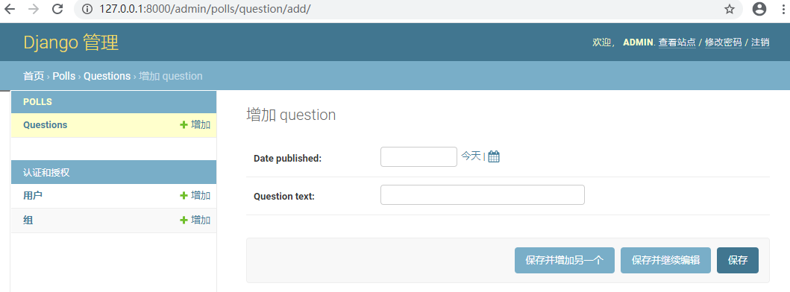
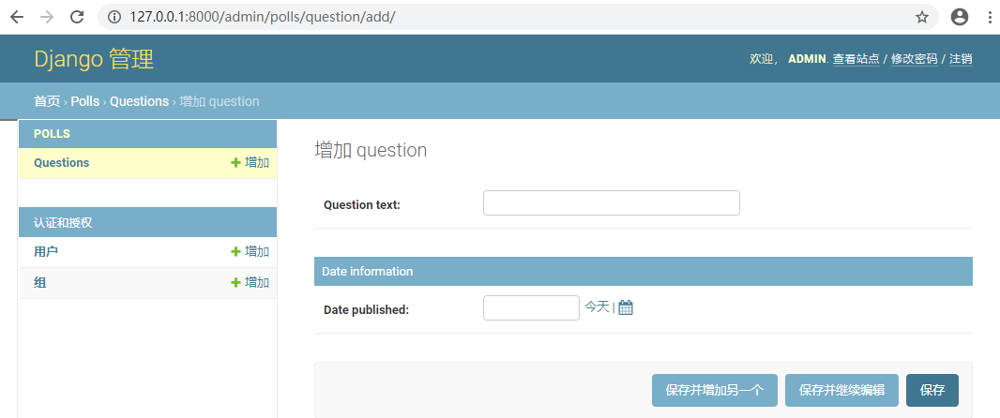
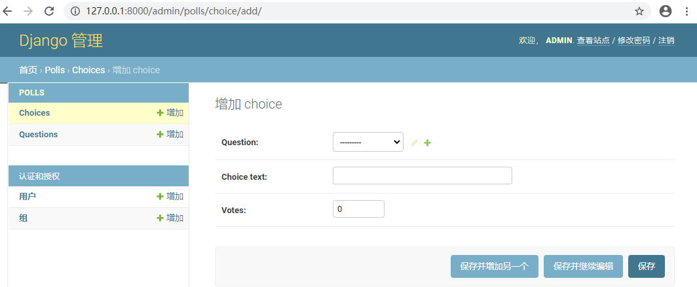
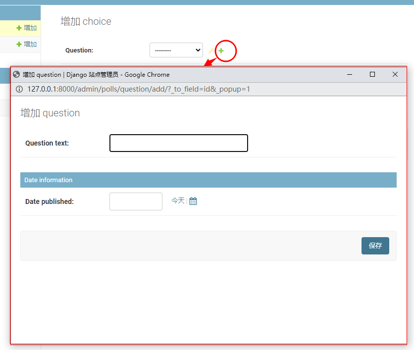
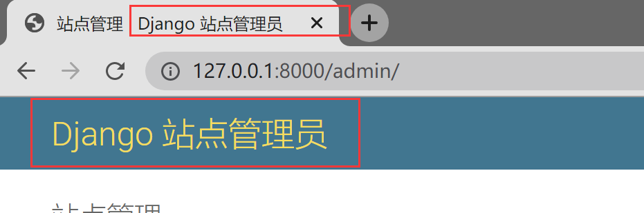
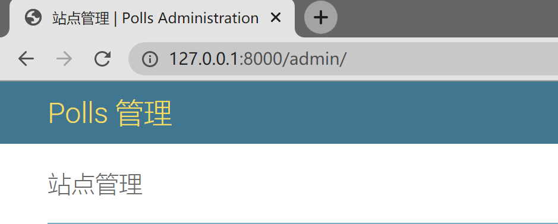

> 跟着官方文档（3.2）快速入门学习Django

# Django官方项目教程

[TOC]

## 前言：

### 1. 什么是Django

Django是一个web开发框架，采用MTV的框架模式，即模型M，视图V和模板T

**web框架**：把常用的和通用性很高的内容提炼出来，进行梳理成一套可重复使用的东西，这个东西就是框架。web框架即与web相关的框架。

**优点**：

- 内置了非常多的常用模块功能，开箱即用，省去了重复造轮子的时间。
- 免费开源
- 开发速度快
- 安全
- 可扩展性强

**缺点**：不够轻量

## 一、Django安装与导入

安装Django

```
pip install django==3.2
```

验证安装

```
C:\Users\Administrator> python -m django --version
3.2
```

导入Django模块

```
>>> import django
>>> django.get_version()
'3.2'
```


## 二、创建Django项目及投票应用

### 1. 创建初始项目目录

cd到一个像放置代码的目录，然后执行以下命令

```
# 在当前目录下创建一个mysite目录
django-admin startproject mysite
```

mysite目录结构如下

```
mysite/
    manage.py
    mysite/
        __init__.py
        settings.py
        urls.py
        asgi.py
        wsgi.py
```

- **manage.py**  一个用于管理Django项目的命令行工具
- **内层mysite/**  包含项目源代码
    - **mysite/settings.py**  Django项目的配置文件
    - **mysite/urls.py**  Django项目的URL声明
    - **mysite/asgi.py**  作为项目的运行在 ASGI 兼容的Web服务器上的入口
    - **mysite/wsgi.py**  作为项目的运行在 WSGI 兼容的Web服务器上的入口

### 2. 运行项目

一个简单的项目就这样创建好了，在外层mysite目录下可以运行这个项目

```
python manage.py runserver
```

.assets/image-20201208202955559.png)

访问http://127.0.0.1:8000/，看到如下页面

.assets/image-20201208203052808.png)

**更换端口**

```
python manage.py runserver 8080
```

**指定监听的ip**

```
# 0是0.0.0.0的简写
python manage.py runserver 0:8080
```

**什么情况下runserver会自动重载python代码？**

- 用于开发的服务器在需要的情况下会对每一次的访问请求重新载入一遍 Python 代码
- 然而，一些动作，比如添加新文件，将不会触发自动重新加载，需要手动重启服务器。


### 3. 创建一个投票应用

在manage.py所在目录下，运行以下命令创建一个应用

```
# 创建一个叫polls的应用
python manage.py startapp polls
```

在这个目录下创建了一个polls目录，目录结构如下

```
polls/
    __init__.py
    admin.py
    apps.py
    migrations/
        __init__.py
    models.py
    tests.py
    views.py
```


## 三、数据库与模型


### 1. 配置数据库

#### 1.1 编辑配置文件

打开 `mysite/settings.py` 。这是个包含了 Django 项目设置的 Python 模块，编辑DATABASES项配置数据库。

```python
# ***** mysite/settings.py *****

# 设置时区
TIME_ZONE = 'Asia/Shanghai'

# 默认配置，使用sqlite
#DATABASES = {
#	'default': {
#        'ENGINE': 'django.db.backends.sqlite3',
#        'NAME': BASE_DIR / 'db.sqlite3',
#    }
#}

# 使用MySQL作为项目数据库
DATABASES = {
    'default': {
        'ENGINE': 'django.db.backends.mysql',
        'NAME': 'polls',
        'USER': 'xxxxxxx',
        'PASSWORD': 'xxxxxxx',
        'HOST': 'xxx.xxx.xxx.xxx',
        'PORT': '3306'
    }
}
```

> 语言与时区设置
>
> ```python
> LANGUAGE_CODE = 'zh-hans'
> 
> TIME_ZONE = 'Asia/Shanghai'
> 
> USE_I18N = True	# 是否应用Django的翻译系统
> 
> USE_L10N = True	# 时间格式，为False，
> # 使用自定义格式，如 DATETIME_FORMAT = "Y/m/d H:i:s0"
> # DATE_FORMAT = 'Y/m/d'
> 
> USE_TZ = False	# 为False，django使用本地的日期时间，如果将其设置为True，则Django将在内部使用可识别时区的日期时间。
> ```
>

- **ENGINE**   可选值有 
  
    - `django.db.backends.sqlite3`
    - `django.db.backends.postgresql`
    - `django.db.backends.mysql`
    - `django.db.backends.oracle`
    
- **NAME**   数据库名称。

    如果你使用 SQLite，数据库将是你电脑上的一个文件，在这种情况下，NAME 应该是此文件完整的绝对路径，包括文件名。默认值 BASE_DIR / 'db.sqlite3' 将把数据库文件储存在项目的根目录。

#### 1.2 初始化数据库驱动

使用MySQL数据库还需要安装MySQLdb驱动

```
pip install pymysql
```

在项目文件夹下添加如下代码

```python
# ***** myweb/myweb/__init__.py *****

import pymysql
pymysql.install_as_MySQLdb()
```

#### 1.3 创建基础表

执行以下命令，创建基础表

```
python manage.py migrate
```

这个 migrate 命令检查 `INSTALLED_APPS` 设置，为其中的每个应用创建需要的数据表。

> settings.py文件头部的INSTALLED_APPS设置项包括了会在项目中启用的所有Django应用，应用能在多个项目中使用，也可以打包且发布项目，让别人使用它们。
>
> 在MySQL中可以看到polls库中已经有如下数据表被创建
>
> ```
> root@localhost [(none)]> use polls
> Database changed
> 
> root@localhost [polls]> show tables;
> +----------------------------+
> | Tables_in_polls            |
> +----------------------------+
> | auth_group                 |
> | auth_group_permissions     |
> | auth_permission            |
> | auth_user                  |
> | auth_user_groups           |
> | auth_user_user_permissions |
> | django_admin_log           |
> | django_content_type        |
> | django_migrations          |
> | django_session             |
> +----------------------------+
> 10 rows in set (0.00 sec)
> ```
>
> - django.contrib.admin -- 管理员站点， 你很快就会使用它。
> - django.contrib.auth -- 认证授权系统。
> - django.contrib.contenttypes -- 内容类型框架。
> - django.contrib.sessions -- 会话框架。
> - django.contrib.messages -- 消息框架。
> - django.contrib.staticfiles -- 管理静态文件的框架。
>
> 这些应用被默认启用是为了给常规项目提供方便。


### 2. 创建模型

模型即数据库结构设计和附加的其它原数据。

下面创建两个模型：问题Question和选项Choice。通过类来创建创建数据模型，每个模型是django.db.models.Model类的子类。每个字段都是Field类的实例，定义某些Field类需要参数。

- **Class Question**  问题

    两个字段：

    - question_text	问题描述

        charField	字符类型

        max_length	最大长度

    - pub_date    发布时间

        DateTimeField	DateTime类型

        ‘date published’  定义的一个人类可读的名字

- **Class Choice**  选项

    两个字段：

    - choice_text	选项描述

    - votes    当前票数

        IntegerField  整数类型

        default=0 默认值为0

    每个选项属于一个问题

    - ForeignKey(Question, on_delete=models.CASCADE)  外键

        定义了每个Choise对象都关联到一个Question对象

        

```python
# ***** mysite/polls/models.py *****

from django.db import models

class Question(models.Model) :
	question_text = models.CharField(max_legth=200)
    pub_date = models.DateTimeField('date published')


class Choice(models.Model):
    question = models.ForeignKey(Question, on_delete=models.CASCADE)
    choice_text = models.CharField(max_length=200)
    votes = models.IntegerField(default=0)
```


### 3. 激活模型

添加polls应用到mysite/settings.py的INSTALLED_APPS，因为 PollsConfig 类写在文件 polls/apps.py 中，所以它的点式路径是 'polls.apps.PollsConfig'。

```python
# ***** mysite/settings.py *****

INSTALLED_APPS = [
    'polls.apps.PollsConfig',
    'django.contrib.admin',
    'django.contrib.auth',
    'django.contrib.contenttypes',
    'django.contrib.sessions',
    'django.contrib.messages',
    'django.contrib.staticfiles',
]
```

执行命令激活模型

```
# 创建数据库迁移文件
python manage.py makemigrations polls

# 可以先使用如下命令查看迁移命令会执行哪些SQL语句
python manage.py sqlmigrate polls 0001

# 迁移数据库（执行SQL，在数据库中创建表）
python manage.py migrate
```

> 执行的SQL：
>
> ```sql
> CREATE TABLE `polls_question` (
>  `id` bigint AUTO_INCREMENT NOT NULL PRIMARY KEY, 
>    `question_text` varchar(200) NOT NULL, 
>  `pub_date` datetime(6) NOT NULL);
> 
> CREATE TABLE `polls_choice` (
> `id` bigint AUTO_INCREMENT NOT NULL PRIMARY KEY, 
>  `choice_text` varchar(200) NOT NULL, 
> `votes` integer NOT NULL, 
>  `question_id` bigint NOT NULL);
> 
> ALTER TABLE `polls_choice` 
> ADD CONSTRAINT `polls_choice_question_id_c5b4b260_fk_polls_question_id` 
> FOREIGN KEY (`question_id`) REFERENCES `polls_question` (`id`);
> ```
> 
> 主键（id）被自动创建，也可以自定义

makemigrations命令检测对模型文件的修改，并把修改的部分存储为一次迁移，存储在polls/migrations/0001_initial.py。

这个 migrate 命令选中所有还没有执行过的迁移（Django 通过在数据库中创建一个特殊的表 django_migrations 来跟踪执行过哪些迁移）并应用在数据库上 - 也就是将你对模型的更改同步到数据库结构上。


> **创建、修改数据模型三部曲**
>
> - **编辑models.py 创建、改变模型**
> - **运行`python manage.py makemigrations`为模型的改变生成迁移文件**
> - **运行`python manage.py migrate`来应用数据库迁移**

### 4. 模型api

输入以下命令进入交互式Python命令行，初始Django创建的各种api

```
python manage.py shell
```

```python
>>> from polls.models import Choice, Question
>>> from django.utils import timezone

>>> Question.objects.all()
<QuerySet []>

>>> q = Question(question_text="What's new?", pub_date=timezone.now())
>>> q.save()
>>> q.id
1

>>> q.question_text
"What's new?"

>>> q.pub_date
datetime.datetime(2020, 12, 14, 10, 12, 55, 462378, tzinfo=<UTC>)

>>> q.question_text = "What's up?"
>>> q.save()

>>> Question.objects.all()
<QuerySet [<Question: Question object (1)>]>
```

给模型添加__str\_\_()方法，条用objects.all()的时候返回更多的细节，再为Question类添加一个自定义方法was_published\_recently()

```python
# ***** mysite/polls/models.py *****

import datetime

from django.db import models
from django.utils import timezone

class Question(models.Model):
	...
	def __str__(self):
		return self.question_text
    
    def was_published_recently(self):
        return self.pub_date >= timezone.now() - datetime.timedelta(days=1)
		
class Choice(models,Model):
	...
	def __str__(self):
		return self.choice_text
```

```
>>> from polls.models import Choice, Question

>>> Question.objects.all()
<QuerySet [<Question: What's up?>]>

>>> Question.objects.filter(id=1)
<QuerySet [Question: What's up?]>

>>> Question.objects.filter(question_text_startswith="What")
<QuerySet [Question: What's up?]>
           
>>> from django.utils import timezone
>>> current_year = timezone.now().year

>>> Question.objects.get(pub_date__year=current_year)
<Question: What' up?>

>>> Question.objects.get(id=2)
Traceback (most recent call last):
           ...
DoesNotExist: Question matching query does not exist.
           
>>> Question.objects.get(pk=1)
<Question: What's up?>
           
>>> q = Question.objects.get(pk=1)
>>> q.was_published_recently()
True
           
>>> q = Question.objects.get(pk=1)
>>> q.choice_set.all()
<QuerySet []>

>>> q.choice_set.create(choice_text='Not much', votes=0)
<Choice: Not much>

>>> q.choice_set.create(choice_text='The sky', votes=0)
<Choice: The sky>

>>> c = q.choice_set.create(choice_text='Just hacking again', votes=0)

>>> c.question
<Question: What's up?>

>>> q.choice_set.all()
<QuerySet [<Choice: Not much>, <Choice: The sky>, <Choice: Just hacking again>]>

>>> q.choice_set.count()
3

>>> Choice.objects.filter(question__pub_date__year=current_year)
<QuerySet [<Choice: Not much>, <Choice: The sky>, <Choice: Just hacking again>]>

>>> c = q.choice_set.filter(choice_text__startswith='Just hacking')
>>> c.delete()
```


## 四、视图和模板

### 1. 编写视图

Django视图的概念：**一类具有相同功能和模板的网页的集合**

投票应用中需要插件的视图：

- 问题索引页——展示最近的几个投票问题。
- 问题详情页——展示某个投票的问题和不带结果的选项列表。
- 问题结果页——展示某个投票的结果。
- 投票处理器——用于响应用户为某个问题的特定选项投票的操作。

URLconf将URL模式映射到视图，使视图和URL关联起来。

**创建视图**：打开polls/views.py

```python
# ***** mysite/polls/views.py *****


from django.http import HttpResponse


def index(request):
    return HttpResponse("Hello, world. You're at the polls index.")
```

**映射URL**

在polls目录中新建一个urls.py文件（这个文件在官方文档中被称为URLconf）

```python
# ***** mysite/polls/urls.py *****

from django.urls import path
from . import views

urlpatterns = [
    path('', views.index, name='index')
]
```

在mysite/mysite/urls.py中指定刚才创建的polls.urls模块

```python
# ***** mysite/mysite/urls.py *****

from django.contrib import admin
from django.urls import include, path

urlpatterns = [
    path('polls/', include('polls.urls')),
    path('admin/', admin.site.urls),
]
```

函数 include() 允许引用其它 URLconfs。每当 Django 遇到 include() 时，它会截断与此项匹配的 URL 的部分，并将剩余的字符串发送到 URLconf 以供进一步处理。**（官方文档原文，我没看懂，大概意思应该是执行mysite/mysite/urls.py时，遇到include时，自动跳到mysite/polls/urls.py去处理吧）**

函数 path() 具有四个参数，两个必须参数：route 和 view，两个可选参数：kwargs 和 name。

- route
- view
- kwargs  任意个关键字参数可以作为一个字典传递给目标视图函数（官方文档中没有使用这一特性）
- name  


**验证是否成功添加视图**

```
python manage.py runserver
```

访问http://ip:8000/polls/

.assets/image-20201211095532867.png)

**编写更多视图**

向mysite/polls/views.py里添加视图

```python
# ***** mysite/polls/views.py *****

from django.shortcuts import render
from django.http import HttpResponse


def index(request):
    return HttpResponse("Hello, world. You're at the polls index.")


def detail(request, question_id):
    return HttpResponse("You're looking at question {}".format(question_id))


def results(request, question_id):
    response = "You're looking at question %s"
    return HttpResponse(response % question_id)


def vote(request, question_id):
    return HttpResponse("You're voting on question %s." %question_id)
```

把新加的视图，添加进mysite/polls/urls.py，添加几个url()函数调用

```python
# ***** mysite/polls/urls.py *****

from django.urls import path
from .import views

urlpatterns = [
    # /polls/
    path("", views.index, name="index"),
    # /polls/5/
    path("<int:question_id>/", views.detail, name='detail'),
    # /polls/5/results/
    path("<int:question_id>/results/", views.results, name='results'),
    # /polls/5/vote/
    path("<int:quesiton_id>/vote/", views.vote, name="vote"),
]
```

运行

```
python manage.py runserver
```

浏览器访问

```
http://127.0.0.1:8000/polls/1/
http://127.0.0.1:8000/polls/1/results/
http://127.0.0.1:8000/polls/1/vote/
```

请求流程：

1. 客户端访问/polls/34/

2. Django载入mysite.urls，这在mysite/settings.py中的配置项ROOT_URLCONF中设置了

    ```python
    # ***** mysite/settings.py *****
    
    ...
    ROOT_URLCONF = 'mysite.urls'
    ...
    ```

3. Django寻找名为urlpatterns变量并且按序匹配正则表达式，找到匹配项polls/

    ```python
    # ***** mysite/urls.py *****
    
    from django.contrib import admin
    from django.urls import include, path
    
    urlpatterns = [
        path('polls/', include('polls.urls')),
        path('admin/', admin.site.urls),
    ]
    ```

4. 然后切掉匹配的文本，将剩余的文本34/发送至polls.urls做进一步处理

### 2. 编写有用的视图 & 模板系统

**每个视图至少要实现：** **返回一个包含被请求内容的HttpResponse对象** 或 **抛出一个异常（如Http404）**

#### 2.1 返回HttpResponse

在mysite/polls/views.py中的index()函数里插入一些新内容，展示数据库里以发布日期排序的最近5个投票问题，以空格分隔

```python
# ***** mysite/polls/views.py *****

from django.http import HttpResponse
from .models import Question

def index(request):
    latest_question_list = Question.objects.order_by('-pub_date')[:5]
    output = ', '.join([q.question_text for q in latest_question_list])
    return HttpResponse(output)
```

#### 2.2 模板

此时的页面设计还写死在视图函数的代码中，使用Django的模板系统可以将页面的设计从代码中分离出来。

1. **创建mysite/polls/templates/目录，Django 将会在这个目录里查找模板文件。**

    > Django能自动到每个应用目录下寻找templates子目录，是因为mysite/settings.py的TEMPLATES配置项中已经设置好了
    >
    > ```python
    > TEMPLATES = [
    >     {
    >         'BACKEND': 'django.template.backends.django.DjangoTemplates',
    >         'DIRS': [],
    >         'APP_DIRS': True,
    >         'OPTIONS': {
    >             'context_processors': [
    >                 'django.template.context_processors.debug',
    >                 'django.template.context_processors.request',
    >                 'django.contrib.auth.context_processors.auth',
    >                 'django.contrib.messages.context_processors.messages',
    >             ],
    >         },
    >     },
    > ]
    > ```
    >
    
2. **在刚刚创建的 templates 目录里，再创建一个目录 polls，然后在其中新建一个文件 index.html** 。模板文件的路径应该是 polls/templates/polls/index.html 。因为``app_directories`` 模板加载器是通过上述描述的方法运行的，所以Django可以引用到 polls/index.html 这一模板了。

    > 在polls/templates目录建立一个polls子目录，再把模板文件放到子目录中是为了避免模板文件与另一个应用中的模板文件重名导致Django无法正确区分

    ```html
    # ***** mysite/polls/templates/polls/index.html（核心代码） *****
    
    
        <ul>
        
            <li><a href="/polls/{{ question.id }}/">{{ question.question_text }}</a></li>
        
        </ul>
    
        <p>No polls are available.</p>
    
    ```

    > **变量**用{{ }}符号包裹，从上下文中得到
    >
    > **标签**用符号包围，定义比较模糊，可以用作控制结构，如for语句、if语句

3. **重新在mysite/polls/views.py的index视图中使用模板。**载入模板mysite/polls/templates/polls/index.html，向它传递一个上下文（context），是一个字典，将模板内的变量映射为Python对象。

    ```python
    # ***** mysite/polls/views.py *****
    
    from django.http import HttpResponse
    from django.template import loader
    
    from .models import Question
    
    def index(request):
        latest_question_list = Question.objects.order_by('-pub_date')[:5]
    
        # 载入模板
        template = loader.get_template('polls/index.html')
        # 填充上下文
        context = {
            'latest_question_list': latest_question_list
        }
        # 返回生成的HttpResponse对象
        return HttpResponse(template.render(context, request))
    ```

4. 访问http://127.0.0.1:8000/polls/

.assets/image-20201216150102251.png)

#### 2.3 快捷函数render()

```python
# ***** mysite/polls/views.py *****

from django.shortcuts import render
from .models import Question

def index(request):
	latest_question_list = Question.objects.order_by('-pub_date')[:5]
	context = {
		'latest_question_list': latest_question_list
	}
	return render(request, 'polls/index.html', context)
```

对比：

```python
template.loader.get_template('polls/index.html')
return HttpResponse(template.render(context, request))

↓

return render(request, 'polls/index.html', context)
```


#### 2.4 抛出404错误

处理投票详情视图，这个视图显示投票的问题标题

```python
# ***** mysite/polls/views.py *****

from django.http import Http404
from django.shortcuts import render

from .models import Question

def detail(request, question_id):
	try:
		question = Question.objects.get(pk=question_id)
	except Question.DoesNotExist:
		raise Http404("Question does not exist")
	return render(request, 'polls/detail.html', {'question': question})
```

> **pk是primary key的缩写，即主键**，id正好是Question表的主键，所以使用pk和id的效果是一样的

如果指定的问题ID不存在，抛出Http404异常

```html
# ***** mysite/polls/templates/polls/detail.html(核心代码) *****

<h1>{{ question.question_text }}</h1>
<ul>

    <li>{{ choice.choice_text }}</li>

</ul>
```

.assets/image-20201217160003883.png)

#### 2.5 快捷函数get_object_or_404()

用于抛出404错误。

```python
# ***** mysite/polls/views.py *****

from django.shortcuts import get_object_or_404, render
from .models import Question

def detail(request, question_id):
	question = get_object_or_404(Question, pk=question_id)
	return render(request, 'polls/detail.html', {'question':question})
```


### 3. 去除模板中的硬编码

按照官方文档中的说法，之前mysite/polls/templates/polls/index.html里编写投票链接时，链接就是硬编码的

```html
<li><a href="/polls/{{ question.id }}/">{{ question.question_text }}</a></li>
```

**硬编码的缺点：修改很困难**

因为在mysite/polls/urls.py的urlpatterns()函数中通过name参数为URL定义了名字，可以使用 `` 标签代替它：

> ```python
> ...
>     path("<int:question_id>/", views.detail, name='detail'),
> ...
> ```

```html
<li><a href="">{{ question.question_text }}</a></li>
```

这个标签在polls.urls模块的URL定义中寻找具有指定名字的条目。通过修改polls.urls模块的内容，来实现修改视图的URL


### 4. 为URL名称添加命名空间

一个Django可能有多个应用，polls应用有detail视图，另一个应用也可能有一个detail视图，为了避免Django分不清楚对对应哪一个应用的URL，需要在应用的urls.py中为url添加命名空间

```python
# ***** mysite/polls/urls.py *****

from django.urls import path
from . import views

# 通过app_name变量为URL添加命名空间
app_name = 'polls'

urlpatterns = [
	path('', views.index, name='index'),
	path('<int:question_id>/', views.detail, name='detail'),
	path('<int:question_id>/results/', views.results, name='results'),
	path('<int:question_id>/vote/', views.vote, name='vote'),
]
```

修改mysite/polls/templates/polls/index.html文件

```html
# 修改前
<li><a href="">{{ question.question_text }}</a></li>

# 修改后  指定具体命名空间
<li><a href="">{{ question.question_text }}</a></li>
```

### 5. 编写表单

**编辑mysite/polls/templates/polls/detail.html**

```html
<!DOCTYPE html>
<html lang="en">
<head>
    <meta charset="UTF-8">
    <title>detail</title>
</head>
<body>
<!--显示问题-->
<h1>{{ question.question_text }}</h1>
<!--如果有错误，显示错误信息-->

<p><strong>{{ error_message }}</strong></p>


<!--遍历所有选项，构建单选框-->
<form action="" method="post">
<!--用于跨站点请求伪造-->


<input type="radio" name="choice" id="choice{{ forloop.counter }}" value="{{ choice.id }}">
<label for="choice{{ forloop.counter }}">{{ choice.choice_text }}</label><br>


<!--按钮：提交-->
<input type="submit" value="Vote">

</form>

</body>
</html>
```

主要内容：

- 一号标题：question.id对应的question_text
- 一个if判断：如果有错误信息，将错误信息加粗输出
- 一个form表单：
    -  模板标签用于跨站点请求伪造
    - 一个for循环 遍历所有的question.id对应的choice对象
    - `<input type="radio">` 单选按钮 id为循环次数，value为choice的id
    - `<label>` choice_text内容
    - 一个按钮，value为vote

**编辑视图vote**

```python
# ***** mysite/polls/views.py *****

from django.shortcuts import render, get_object_or_404
from django.http import HttpResponse, Http404, HttpResponseRedirect
from django.template import loader
from django.urls import reverse

from .models import Question, Choice


def vote(request, question_id):
    # 如果question_id不存在，抛出404错误
    # 如果question_id存在，相当于question = Question.objects.get(pk=question_id)
    question = get_object_or_404(Question, pk=question_id)

    try:
        # 前端页面发送POST请求到后端，获取choice相关的信息
        selected_choice = question.choice_set.get(pk=request.POST['choice'])
    except (KeyError, Choice.DoesNotExist):
        return render(request, 'polls/detail.html', {
            'question': question,
            'error_message': "You didn't select a choice."
        })
    else:
        # 将所选择的选项的票数+1，然后保存
        selected_choice.votes += 1
        selected_choice.save()
        # 将页面重定向到结果页面
        return HttpResponseRedirect(reverse('polls:results', args=(question.id,)))
```

- request.POST    一个类字典对象，可以通过关键字的名字获取提交的数据

    request.POST['choice']以字符串形式返回选择的Choice ID

- HttpResponseRedirect 只接收一个参数：用户将要被重定向的 URL

-  `reverse()` 调用将返回一个这样的字符串：`/polls/<int: question_id>/results/`，重定向的URL将调用results视图来显示最终的页面。

如果在 request.POST['choice'] 数据中没有提供 choice ， POST 将引发一个 KeyError 。上面的代码检查 KeyError ，如果没有给出 choice 将重新显示 Question 表单和一个错误信息。

**编辑result视图**

```python
# ***** mysite/polls/views.py *****

from django.shortcuts import get_object_or_404, render

def result(request, question_id):
    question = get_object_or_404(Question, pk=question_id)
    return render(request, 'polls/results.html', {'question': question})
```

**创建results.html模板**

```html
# ***** mysite/polls/templates/polls/results.html *****

<!DOCTYPE html>
<html lang="en">
<head>
    <meta charset="UTF-8">
    <title>Title</title>
</head>
<body>
<h1>{{ question.question_text }}</h1>

<ul>
    
    <li>{{ choice.choice_text }} -- {{ choice.votes }} vote{{ choice.votes|pluralize }}</li>
    
</ul>

<!--跳转到投票详情页-->
<a href="">Vote again?</a>
</body>
</html>
```

主要内容：

- 一号标题：question.id对应的question_text
- for循环  遍历question.id对应的所有choice记录

**访问流程**

访问http://127.0.0.1/polls/2/，也就是detail视图，模板是mysite/polls/templates/polls/detail.html，页面内容如下，由于没有question.id=2没有对应的Choice记录，所以只有一个按钮显示

.assets/image-20201222162230841.png)

提交后显示错误信息

.assets/image-20201222171055472.png)

> 这里不知道是不是我之前跟着文档操作的时候漏了，现在我的Choice表中没有数据，因此我手动给question.id=1添加了一条Choice记录
>
> .assets/image-20201222170338883.png)

访问http://127.0.0.1:8000/polls/1/

.assets/image-20201222171333205.png)


点击Vote按钮，访问了vote视图，choice.vote+1，然后重定向到http://127.0.0.1:8000/polls/1/result/显示投票结果

.assets/image-20201222171437270.png)

### 6. 使用通用视图

以上视图反映了web开发的一个常见情况：**根据URL中的参数从数据库中获取数据、载入模板然后返回渲染后的模板**。Django提供了一种快捷方式——**通用视图**

将现有投票应用转换为通用视图：

1. **转换URLconf**

    ```python
    # ***** mysite/polls/urls.py *****
    
    from django.urls import path
    from . import views
    
    app_name = 'polls'
    
    urlpatterns = [
        # /polls/
        path("", views.IndexView.as_view(), name="index"),
        # /polls/1/
        path("<int:pk>/", views.DetailView.as_view(), name='detail'),
        # /polls/1/results/
        path("<int:pk>/results/", views.ResultsView.as_view(), name='results'),
        # /polls/1/vote/
        path("<int:question_id>/vote/", views.vote, name="vote"),
    ]
    ```

    .assets/image-20201222204256702.png)

2. **删除旧的、不再需要的视图，使用通用视图替代。**

    将之前的旧视图index、detail、results删除

    ```python
    from django.shortcuts import render, get_object_or_404
    from django.http import HttpResponseRedirect
    from django.urls import reverse
    from django.views import generic
    
    from .models import Question, Choice
    
    
    # 通用视图ListView，抽象显示一个对象列表
    class IndexView(generic.ListView):
        # template_name指定使用的模板
        template_name = 'polls/index.html'
    
        context_object_name = 'latest_question_list'
    
        def get_queryset(self):
            return Question.objects.order_by('-pub_date')[:5]
    
    
    # 通用视图DetailView，抽象显示一个特定类型对象的详细信息页面
    class DetailView(generic.DetailView):
        # model表示作用于哪个哪个模型
        # 自动提供:
        #     question = Question.objects.get(pk=question_id)
        #     context = {'question': question}
        model = Question
        template_name = 'polls/detail.html'
    
    
    class ResultsView(generic.DetailView):
        model = Question
        template_name = 'polls/results.html'
    
    
    # vote视图没有变化
    def vote(request, question_id):
    	...
    ```

    这里使用了两个通用视图：

    - **ListView**  显示一个对象列表
    - **DetailView**  显示一个特定类型对象的详细信息页面

    **model**属性指示将作用于哪个数据模型

    **template_name**属性指定使用的模板

    > ListView默认模板`<app name>/<model name>_list.html`
    >
    > DetailView默认模板 `<app name>/<model name>_detail.html`

    之前使用模板时有一个包含question和latest_question_list变量的context，

    - 对于DetailView，question变量会自动提供，并为context变量决定一个合适的名字。

    - 对于ListView，自动生成的context变量是question_list

    Django提供了context_object_name属性表示想使用latest_question_list

    DetailView 期望从 URL 中捕获名为 "pk" 的主键值，所以我们为通用视图把 question_id 改成 pk 

3. 给予Django的通用视图引入新的视图

> 对比：
>
> .assets/image-20211221155406672.png)


## 五、自动化测试及对方法进行测试

### 1. 了解自动化测试

**什么是自动化测试？**

通过测试代码来自动地测试应用能否正常运行。

**为什么要进行自动化测试？**

- 节约时间
- 发现并预防错误
- 有利于团队协作
- 增强代码的可信度（对其他人）

**基础测试策略**

- 先写测试，再写代码
- 先写代码，在写测试

**建议**

- 当需要测试的时候，测试用例越多越好（哪怕测试代码比正式代码还多）

- 对每个模型和视图建立单独的TestClass
- 每个测试方法只测试一个功能
- 给每个测试方法起个能描述其功能的名字

### 2. 对bug的测试及修复

#### 2.1 创建测试暴露bug

**现有的bug**：要求是如果 Question 是在一天之内发布的， `Question.was_published_recently()` 方法将会返回 True ，然而现在这个方法在 Question 的 pub_date 字段比当前时间还晚时也会返回 True（这是个 Bug）

**确认bug**

```python
$ python manage.py shell
>>> import datetime
>>> from django.utils import timezone
>>> from polls.models import Question

# 创建了一个pub_date为30天后的question实例
>>> future_question = Question(pub_date=timezone.now() + datetime.timedelta(days=30))
>>> future_question.was_published_recently()
True
```

**编写测试代码**

测试代码写在mysite/polls/tests.py里

```python
# ***** mysite/polls/tests.py *****

from django.test import TestCase

import datetime
from django.utils import timezone
from .models import Question


class QuestionModelTests(TestCase):
    def test_was_published_recently_with_future_qeustion(self):
        time = timezone.now() + datetime.timedelta(days=30)
        
        # pub_date为30天后的Question实例
        future_question = Question(pub_date=time)
        
        self.assertIs(future_question.was_published_recently(), False)
```

如上，创建了一个django.test.TestCase的子类，添加了一个测试方法（方法名巨长，以test开头），此方法创建了一个pub_date是未来某天的Question实例，然后检查was_published_recently()方法的返回值，预计的返回值是False

> 之前创建数据模型时在Question模型中添加了方法was_published_recently()
> ```Python
> # ***** mysite/polls/models.py *****
> 
> class Question(models.Model):
> 	...
>    	def was_published_recently(self):
> 		...
> ```

**运行测试**

```
python manage.py test polls
```

运行结果：

```
Creating test database for alias 'default'...
System check identified no issues (0 silenced).
F
======================================================================
FAIL: test_was_published_recently_with_future_qeustion (polls.tests.QuestionModelTests)
----------------------------------------------------------------------
Traceback (most recent call last):
  File "D:\Charramma\Django_demo\mysite\polls\tests.py", line 12, in test_was_published_recently_with_future_qeustion
    self.assertIs(future_question.was_published_recently(), False)
AssertionError: True is not False

----------------------------------------------------------------------
Ran 1 test in 0.001s

FAILED (failures=1)
Destroying test database for alias 'default'...
```

**运行流程：**

1. `python manage.py test polls`

    寻找polls应用里的测试代码polls/test.py

2. 找到django.test.TestCase的一个子类

3. 创建一个特殊的数据库供测试使用

    `Creating test database for alias 'default'...`

4. 在类中寻找测试方法（以test开头的方法）

5. 运行测试方法，使用其中的assertls()方法，发现was_published_recently()返回了True，与期望值不同，抛出错误`Creating test database for alias 'default'...`，同时，指示了错误行数——第12行，也就是`self.assertIs(future_question.was_published_recently(), False)`

#### 2.2 修复bug

修改models.py里的方法，让它只在日期是现在时间及之前的时候才返回True：

```python
# ***** mysite/polls/models.py *****

class Question(models.Model):
	...
    def was_published_recently(self):
        now = timezone.now()
        return now - datetime.timedelta(days=1) <= self.pub_date <= now
```

重新测试

```
python manage.py test polls
Creating test database for alias 'default'...
System check identified no issues (0 silenced).
.
----------------------------------------------------------------------
Ran 1 test in 0.001s

OK
Destroying test database for alias 'default'...
```

#### 2.3 全面的测试

在mysite/polls/tests.py中的QuestionModelTests类中添加两个测试方法，全面的测试was_published_recently()方法，以确定安全性。

```python
# ***** mysite/polls/tests.py *****

class QuestionModelTests(TestCase):
    
    def test_was_published_recently_with_future_qeustion(self):
    	"""
    	将来
    	"""
        time = timezone.now() + datetime.timedelta(days=30)
        future_question = Question(pub_date=time)
        self.assertIs(future_question.was_published_recently(), False)

    def test_was_published_recently_with_old_question(self):
        """
        过去
        """
        time = timezone.now() - datetime.timedelta(days=1, seconds=1)
        old_question = Question(pub_date=time)
        self.assertIs(old_question.was_published_recently(), False)

    def test_was_published_recently_with_recent_question(self):
        """
        现在
        """
        time = timezone.now() - datetime.timedelta(hours=23, minutes=59, seconds=59)
        recent_question = Question(pub_date=time)
        self.assertIs(recent_question.was_published_recently(), True)
```

### 3. 测试视图

#### 3.1 Django的测试工具Client

**Client用于测试时模拟用户和视图层代码的交互。**

进入shell环境

```
python manage.py shell
```

```python
>>> from django.test.utils import setup_test_environment
>>> setup_test_environment()		# 提供了一个模板渲染器，允许为responses添加一些额外的属性

# 创建Client对象
>>> from django.test import Client
>>> client = Client()

>>> response = client.get('/')
Not Found: /

>>> response.status_code
404

>>> from django.urls import reverse
>>> response = client.get(reverse('polls:index'))
>>> response.status_code
200

>>> response.content
b'\n\n\n\n\n\n\n\n\n\n\n\n    <ul>\n        \n            <li><a href="/polls/2/">What&#x27;s new?</a></li>\n        \n            <li><a href="/polls/1/">What&#x
27;s up?</a></li>\n        \n    </ul>\n'

>>> response.context['latest_question_list']
<QuerySet [<Question: What's new?>, <Question: What's up?>]>
```

#### 3.2 改善视图代码

现在的投票列表存在bug，当pub_date值为未来的某天，投票列表会显示将来的投票

> 之前的代码
>
> ```python
> # ***** mysite/polls/views.py *****
> 
> import ...
> from django.views import generic
> from .models import Question, Choice
> 
> class IndexView(generic.ListView):
>     template_name = 'polls/index.html'
>     context_object_name = 'latest_question_list'
>     
>     def get_queryset(self):
>         return Question.objects.order_by("-pub_date")[:5]
> ```

改进get_queryset()方法，通过将Question的pub_date属性与timezone.now()相比较来判断是否应该显示此Question

```python
# ***** mysite/polls/views.py *****

import ...
from django.utils import timezone
from django.views import generic
from .models import Question, Choice

class IndexView(generic.ListView):
    template_name = 'polls/index.html'
    context_object_name = 'latest_question_list'
    
    def get_queryset(self):
        # filter()方法将大于timezone.now()的都过滤掉
        return Question.objects.filter(pub_date__lte=timezone.now()).order_by('-pub_date')[:5]
```

#### 3.2 测试新视图

添加以下代码到polls/tests.py

```python
# ***** mysite/polls/tests.py *****

import ...
from django.urls import reverse

def create_question(question_text, days):
    """
    一个公用的快捷函数，用于创建投票问题
    """
    time = timezone.now() + datetime.timedelta(days=days)
    return Question.objects.create(question_text=question_text, pub_date=time)

class QuestionModelTests(TestCase):
    ...
    
class QuestionIndexViewTest(TestCase):
    def test_no_questions(self):
        """
        没有创建任何投票
        检查返回的网页上有没有"No polls are available."这段消息和latest_question_list是否为空
        """
        response = self.client.get(reverse('polls.index'))
        self.assertEqual(response.status_code, 200)
        self.assertContains(response, "No polls are available.")
        self.assertQuerysetEqual(response.context['latest_question_list'], [])

    def test_past_question(self):
        """
        创建了一个投票并检查是否出现在列表中
        """
        create_question(question_text="Past question.", days=-30)
        response = self.client.get(reverse('polls:index'))
        self.assertQuerysetEqual(
            response.context['latest_question_list'],
            ['<Question: Past question.>']
        )

    def test_future_question(self):
        """
        创建pub_date在未来某天的投票
        数据库会在调用测试方法前被重置
        """
        create_question(question_text="Future question.", days=30)
        response = self.client.get(reverse('polls:index'))
        self.assertContains(response, "No polls are available.")
        self.assertQuerysetEqual(response.context['latest_question_list'], [])

    def test_future_question_and_past_question(self):
        create_question(question_text="Past question.", days=-30)
        create_question(question_text="Future question.", days=30)
        response = self.client.get(reverse('polls:index'))
        self.assertQuerysetEqual(
            response.context['latest_question_list'],
            ['<Question: Past question.>']
        )

    def test_two_past_questions(self):
        create_question(question_text="Past question 1.", days=-30)
        create_question(question_text="Past question 2.", days=-5)
        response = self.client.get(reverse('polls:index'))
        self.assertQuerysetEqual(
            response.context['latest_question_list'],
            ['<Question: Past question 2.>', '<Question: Past question 1.>']
        )
```

#### 3.3 测试DetailView

现在发布日期是未来某天的投票不会在目录页index中出现，但是仍有url可以访问到它们。为了避免用户访问到这些url，需要在DetailView中增加一些约束。

> 之前的代码
>
> ```python
> class DetailView(generic.DetailView):
>     model = Question
>     template_name = 'polls/detail.html'
> ```

```python
# ***** mysite/polls/views.py *****

class DetailView(generic.DetailView):
    model = Question
    template_name = 'polls/detail.html'
    
    def get_queryset(self):
        return Question.objects.filter(pub_date__lte=timezone.now())
```

添加测试类

```python
# ***** mysite/polls/tests.py *****

# ...

class QuestionDetailViewTests(TestCase):
    def test_future_question(self):
        future_question = create_question(question_text='Future question.', days=5)
        url = reverse('polls:detail', args=(future_question.id,))
        response = self.client.get(url)
        self.assertEqual(response.status_code, 404)

    def test_past_question(self):
        past_question = create_question(question_text='Past Question.', days=-5)
        url = reverse('polls:detail', args=(past_question.id,))
        response = self.client.get(url)
        self.assertContains(response, past_question.question_text)
```


## 六、 添加静态文件

> 管理静态文件：https://docs.djangoproject.com/zh-hans/3.2/howto/static-files/

### 1. 静态文件相关配置

静态文件指图片、脚本、样式表等文件。

`django.contrib.staticfiles`将各个应用的静态文件统一收集起来，集中在一个便于分发的地方。

在**mysite/polls目录**下创建一个名为**static**的目录，Django将在此目录下查找静态文件

> ```python
> # ***** mysite/settings.py *****
> 
> STATIC_URL = '/static/'
> ```

同样为了避免多项目的同名静态文件混淆，在static下新建一个polls目录，在里面创建一个style.css文件

```css
# ***** mysite/polls/static/polls/style.css *****

li a {
	color: green;
}
```

### 2. 添加样式

```html
# ***** mysite/polls/templates/polls/index.html *****

<head>
    <meta charset="UTF-8">
    <title>Title</title>
    
    <link rel="stylesheet" type="text/css" href="">
</head>
```

运行

```
python manage.py runserver
```

效果

.assets/image-20201228112420563.png)

### 3. 添加背景图

在**mysite/polls/static/polls目录**下创建一个名为**images目录**，在这个目录里放一张背景图片，我放了一张文件名为wallhaven-9mxpx1.png的图片。在style.css中添加样式

```css
# ***** mysite/polls/static/polls/style.css *****

body {
    background: white url("images/wallhaven-9mxpx1.png") no-repeat;
}
```

.assets/image-20201228114342790.png)

## 七、Django管理页面

### 1. 创建管理员账号

执行以下命令

```
python manage.py createsuperuser
```

> ```
> D:\Charramma\git_repositories\Django_learning\mysite>python manage.py createsuperuser
> Username (leave blank to use 'charramma'): admin
> Email address: admin@example.com
> Password:
> Password (again):
> This password is too short. It must contain at least 8 characters.
> This password is too common.
> This password is entirely numeric.
> Bypass password validation and create user anyway? [y/N]: y
> Superuser created successfully.
> 
> ```
>
> 这里我输入的是123456，提示密码复杂度太低

启动django开发服务器

```
python manage.py runserver
```

浏览器访问

http://127.0.0.1:8000/admin/

.assets/image-20201213184344367.png)

输入用户名和密码进入如下界面

.assets/image-20201213184529011.png)

如果要让界面是中文的，在mysite/mysite/settings.py中修改LANGUAGE_CODE变量的值

```python
# ***** mysite/mysite/settings.py *****

...
LANGUAGE_CODE = 'zh-hans'
...
```

.assets/image-20201213184925075.png)

认证和授权应用由django.contrib.auth提供，是Django开发的认证框架

### 2. 向管理页面中加入投票应用

给Question对象一个后台接口

```python
# ***** mysite/polls/admin.py *****

from django.contrib import admin
from .models import Question

admin.site.register(Question)
```


点击Question，会显示数据库中所有的问题Question对象，还可以点击“增加”来添加Question对象

.assets/image-20201213185654315.png)

点击“What‘s up?”还可以对现有的Question对象进行编辑。

> 这不比flask方便？

.assets/image-20201213185825346.png)

- 表单是从Question模型自动生成

- 不同字段类型会生成对应的HTML输入控件

    > 比如日历控件，我当初辛辛苦苦找控件源码找出来感觉还没这个好看。
    >
    > .assets/image-20201213190345794.png)

### 3. 自定义管理后台表单

**自定义表单的外观和工作方式**

```python
# ***** mysite/polls/admin.py *****

from django.contrib import admin
from .models import Question


# 模型后台类
class QuestionAdmin(admin.ModelAdmin):
    # 使得Publication date字段显示在Question字段之前
    fields = ['pub_date', 'question_text']


admin.site.register(Question, QuestionAdmin)
```

> 之前的代码
>
> ```python
> # ***** mysite/polls/admin.py *****
> 
> from django.contrib import admin
> from .models import Question
> 
> # 注册Question模型，构建一个默认的表单用于展示
> admin.site.redister(Question)
> ```

之前



现在



可以看到Publication date字段显示在Question字段之前


**将表单分为几个字段集**

```python
# ***** mysite/polls/admin.py *****

# ...

class QuestionAdmin(admin.ModelAdmin):
    fieldsets = [
        (None, {'fields': ['question_text']}),
        ('Date information', {'fields': ['pub_date']}),
    ]


admin.site.register(Question, QuestionAdmin)
```



**fieldsets**元组中的第一个元素是字段集的标题


### 4. 添加关联对象

后台注册Choice

```python
# ***** mysite/polls/admin.py *****

from django.contrib import admin
from .model import Choice, Question

# ...
admin.site.register(Choice)
```



Question旁边有一个加号，每个使用ForeignKey关联到另一个对象的对象会自动获得这个功能，并且Django知道要将ForeignKey在后台以选择框`<select>`的形式展示。

点击添加Question，会弹出一个小弹窗



保存后Django会将其保存至数据库，并动态地在正在查看的添加选项表单中选中它。

**添加关联对象更好的办法：在你创建“投票”对象时直接添加好几个选项。**

移除调用register()注册Choice模型的代码，随后修改Question的注册代码。这会告诉 Django：“Choice 对象要在 Question 后台页面编辑。默认提供 3 个足够的选项字段。”

```python
# ***** mysite/polls/admin.py *****

from django.contrib import admin
from .models import Choice, Question


class ChoiceInline(admin.StackedInline):
    model = Choice
    # 提供3个足够的选项字段
    extra = 3


class QuestionAdmin(admin.ModelAdmin):
    fieldsets = [
        (None, {'fields': ['question_text']}),
        ('Date information', {'fields': ['pub_date'], 'classes': ['collapse']}),
    ]
    # Choice对象在Question后台页面编辑
    inlines = [ChoiceInline]


admin.site.register(Question, QuestionAdmin)
```

extra定义关联的 选项插槽

.assets/image-20201228203431411.png)

表格式单行显示关联对象。修改ChoiceInline声明

```python
# ***** mysite/polls/admin.py *****

class ChoiceInline(admin.TabularInline):
	# ...
```


.assets/image-20201229113501135.png)


### 5. 自定义后台更改列表

修改【更改列表】页面为一个能展示系统中所有投票的页面

```python
# ***** mysite/polls/admin.py *****

class QuestionAdmin(admin.ModelAdmin):
	...
	list_display = ("question_text", "pub_date")
```

- list_display 包含要显示对的字段名的元祖，在更改列表页中以列的形式展示这个对象

    .assets/image-20210103140808597.png)


 **按照官方文档，在list_display中加上 was_published_recently()方法**

  ```python
# ***** mysite/polls/admin.py *****

# ...
class QuestionAdmin(admin.ModelAdmin):
    # ...
    list_display = ('question_text', 'pub_date', 'was_published_recently')
  ```

 但是我加上后，访问http://127.0.0.1:8000/admin/polls/question/，报错

 错误位置在mysite/polls/models.py中，意思是下面这个return语句中返回的是两种类型，不能互相比较

> return now - datetime.timedelta(days=1) <= self.pub_date <= now
> TypeError: can't compare datetime.datetime to datetime.date

  ```python
# **** mysite/polls/models.py ****

# ...
def was_published_recently(self):
	now = timezone.now()
	return now - datetime.timedelta(days=1) <= datetime.datetime.strptime(str(self.pub_date), '%Y-%m-%d') <= now
  ```

>  `self.pub_date` 是datetime.date类型
>
>  `timezone.now()` 是datetime.datetime类型
>
>  `datetime.timedelta(days=1)` 是datetime.timedelta类型
>
>  `now-datetime.timedelta(days=1)`得到的时间就是当前时间减一天，类型为datetime.datetime类型

**将self.pub_date先转换为str，然后转换为datetime.datetime类型**

`datetime.datetime.strptime(str(self.pub_date)`

```python
# **** mysite/polls/models.py ****

def was_published_recently(self):
    # ...
    return now - datetime.timedelta(days=1) <= datetime.datetime.strptime(str(self.pub_date), '%Y-%m-%d') <= now
```

然后访问，还是那条语句报了另一种错误

> TypeError: can't compare offset-naive and offset-aware datetimes

这是说两个时间，一个是有时区的一个没有时区，不能一起比较

**将now转为无时区的**

`now = timezone.now().replace(tzinfo=None)`

```python
# **** mysite/polls/models.py ****

# ...
def was_published_recently(self):
	now = timezone.now().replace(tzinfo=None)
	return now - datetime.timedelta(days=1) <= datetime.datetime.strptime(str(self.pub_date), '%Y-%m-%d') <= now
```

现在可以显示出官网上的效果

.assets/image-20210103144919166.png)


**默认可以点击列标题来进行排序**

.assets/image-20210103145508912.png)

WAS_PUBLISHED_RECENTLY列因为没有实现排序算法，所以无法点击进行排序。

给was_published_recently()方法添加属性

```python
# **** mysite/polls/models.py ****

class Question(models.Model):
    # ...
    def was_published_recently(self):
        now = timezone.now()
        return now - datetime.timedelta(days=1) <= datetime.datetime.strptime(str(self.pub_date), '%Y-%m-%d') <= now
    
    # admin_order_field用于表名list_display的元素代表某个数据库字段
    was_published_recently.admin_order_field = 'pub_date'
    # 以图标显示True和False
    was_published_recently.boolean = True
    # 自定义列的标题
    was_published_recently.short_description = 'Published recently?'
```

> list_display文档：https://docs.djangoproject.com/zh-hans/3.1/ref/contrib/admin/#django.contrib.admin.ModelAdmin.list_display

.assets/image-20210103151104906.png)

**添加侧边栏过滤器**

再次编辑文件 polls/admin.py，优化 Question 变更页：过滤器，使用 list_filter。将以下代码添加至 QuestionAdmin：

```python
# **** mysite/polls/admin.py ****

class QuestionAdmin(admin.ModelAdmin):
	# ...
    list_filter = ['pub_date']
```

添加了一个“过滤器”侧边栏，允许**以pub_date字段来过滤列表**

.assets/image-20210103151211410.png)

**添加顶部搜索框**

```python
# **** mysite/polls/admin.py ****

class QuestionAdmin(admin.ModelAdmin):
	# ...
    search_fields = ['question_text']
```

.assets/image-20210103152307526.png)

默认每页显示100项


### 6. 自定义后台界面和风格

以管理界面为例，现在的管理界面如下所示

.assets/image-20210103181055114.png)

> admin是内置的应用，需要一个目录在存放复写的模板

**在manage.py所在目录下创建一个名为templates的目录。**

打开设置文件（mysite/settings.py），添加DIRS选项

```python
# ***** mysite/mysite/settings.py *****

TEMPLATES = [
    {
        'BACKEND': 'django.template.backends.django.DjangoTemplates',
        'DIRS': [BASE_DIR / 'templates'],
        'APP_DIRS': True,
        'OPTIONS': {
            'context_processors': [
                'django.template.context_processors.debug',
                'django.template.context_processors.request',
                'django.contrib.auth.context_processors.auth',
                'django.contrib.messages.context_processors.messages',
            ],
        },
    },
]
```

**DIRS** 是一个包含多个系统目录的文件列表，用于在载入 Django 模板时使用，是一个待搜索路径。

> 之前都是因为设置文件中已经制定了某个目录要放在某个位置，这次是先找个地方新建目录，然后在设置文件指定目录位置

**在mysite/templates目录中创建一个admin目录**，随后，将存放 Django 默认模板的目录（django/contrib/admin/templates）内的模板文件 **admin/base_site.html** 复制到这个目录内。

> 获取Django源码位置
> ```
> > python -c "import django; print(django.__path__)"
> ['D:\\Program Files\\Python\\Python39\\lib\\site-packages\\django']
> ```
>
> `D:\Program Files\Python\Python39\Lib\site-packages\django\contrib\admin\templates\admin\base_site.html`


修改前

```html
# ***** mysite/templates/admin/base_site.html *****



{{ title }} | {{ site_title|default:_('Django site admin') }}


<h1 id="site-name"><a href="">{{ site_title|default:_('Django site admin') }}</a></h1>



```

- `{{ title }} | {{ site_title|default:_('Django site admin') }}` 网页的title

- `<h1 id="site-name"><a href="">{{ site_title|default:_('Django site admin') }}</a></h1>` 标题

    

修改后

```
# ***** mysite/templates/admin/base_site.html *****



{{ title }} | Polls Administration


<h1 id="site-name"><a href="">Polls 管理</a></h1>



```



**所有的 Django 默认后台模板均可被复写。若要复写模板，像你修改 `base_site.html` 一样修改其它文件——先将其从默认目录中拷贝到你的自定义目录，再做修改。**


## 八、归纳

### 1. 图示项目流程

官网的基础教程到此结束，以下是我自己归纳的基本项目流程部分。

.assets/image-20210103210329017.png)

### 2. 文档地址：

- 文档目录：https://docs.djangoproject.com/zh-hans/3.1/contents/

- 配置文档：https://docs.djangoproject.com/zh-hans/3.2/ref/settings/#std:setting-DATABASES
- 模型字段参考：https://docs.djangoproject.com/zh-hans/3.2/ref/models/fields/#django.db.models.Field
- 时区支持文档：https://docs.djangoproject.com/zh-hans/3.2/topics/i18n/timezones/
- 关联对象参考文档：https://docs.djangoproject.com/zh-hans/3.2/ref/models/relations/
- 模板文档：https://docs.djangoproject.com/zh-hans/3.2/topics/templates/
- 通用视图文档：https://docs.djangoproject.com/zh-hans/3.2/topics/class-based-views/
- 测试文档：https://docs.djangoproject.com/zh-hans/3.2/topics/testing/


## 九、扩展

### 1. 打包、发布应用

> 官方文档上的打包步骤是将项目打包为一个模块包，不是发布到服务器上用的包，对我来说暂时用处不大
>
> https://docs.djangoproject.com/zh-hans/3.1/intro/reusable-apps/


### 2. 生成项目依赖包文件requirements.txt

1. 安装pipreqs模块

    这个模块可以自动生成依赖包文件，不需要人工生成

    ```
    pip install pipreqs
    ```

2. 生成requirements.txt文件

    在项目根目录下执行

    ```
    pipreqs ./ --encoding utf-8
    ```

    > 不加--encoding 指定编码会报如下错误：
    >
    > UnicodeDecodeError: 'gbk' codec can't decode byte 0x80 in position 213: illegal multibyte sequence

3. 根据requirements.txt文件安装依赖

    ```
    pip install -r requirements.txt
    ```

### 3. 创建Python虚拟环境

1. 创建虚拟环境

    ```
    python3 -m venv <虚拟环境名>
    ```

    会在当前目录下创建一个虚拟环境目录

2. 激活虚拟环境

    ```
    # windows
    <虚拟环境目录>\Scripts\activate.bat
    
    # Unix/MacOS
    source <虚拟环境目录>/bin/activate
    ```


### 4. Django版本差异

> 该笔记初版是2021年初，彼时3.2版本还未发布，截止目前2021年12月22日，Django4.0版都已经发布了。。。

#### 4.1 Django3.2与Django3.1的版本差异

> https://docs.djangoproject.com/en/dev/releases/3.2/

- Django3.2只支持Python3.6及以上版本

- Django3.2版本将放弃对MySQL 5.6, PostgreSQL 9.5及之前版本的支持

- 自动发现AppConfig类

    在Django 3.1及之前版本中，如果你将app名加入到INSTALLED_APP里并希望apps.py里的AppConfig配置类生效，你还需要还需要修改app目录下的`__init__.py`, 通过default_app_config手动指定AppConfig配置类。Django 3.2以后，你再也不用纠结INSTALLED_APPS中应该写app名，还是AppConfig子类了，两者将变得完全等同。default_app_config属性也将被删除。

- 新的django.core.cache.backends.memcached.PyMemcacheCache缓存后端允许将pymemcache库用于memcached。pymemcache需要3.4.0或更高版本。

- 智能分页

    Django自带分页类将新增get_elided_page_range方法。你可以通过on_each_side和on_ends选项，实现智能分页。

    `Paginator.get_elided_page_range`(*number*, ***, *on_each_side=3*, *on_ends=2*)¶

    当你的页面数非常多时，不会像现在一样所有页码都会显示。新的分页自带缩略，显示效果如下：

    [1, 2, '…', 7, 8, 9, 10, 11, 12, 13, '…', 49, 50]

- 其他细小变化
