> 跟着官方文档（3.1）学习Django的笔记

## 一、Django安装与导入

安装Django

```
pip install Django
```

验证安装

```
C:\Users\Administrator>python -m django --version
3.1.4
```

导入Django模块

```
>>> import django
>>> print(django.get_version())
3.1.4
>>>
```


## 二、创建Django项目

### 1. 创建初始项目目录

cd到一个像放置代码的目录，然后执行以下命令

```
# 在当前目录下创建一个mysite目录
django-admin startproject mysite
```

mysite目录结构如下

```
mysite/
    manage.py
    mysite/
        __init__.py
        settings.py
        urls.py
        asgi.py
        wsgi.py
```

- **manage.py**  一个用于管理Django项目的命令行工具
- **内层mysite/**  包含项目源代码
    - **mysite/settings.py**  Django项目的配置文件
    - **mysite/urls.py**  Django项目的URL声明
    - **mysite/asgi.py**  作为项目的运行在 ASGI 兼容的Web服务器上的入口
    - **mysite/wsgi.py**  作为项目的运行在 WSGI 兼容的Web服务器上的入口

### 2. 运行项目

一个简单的项目就这样创建好了，在外层mysite目录下可以运行这个项目

```
python manage.py runserver
```

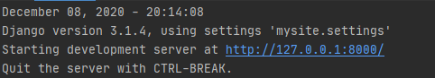

访问http://127.0.0.1:8000/，看到如下页面

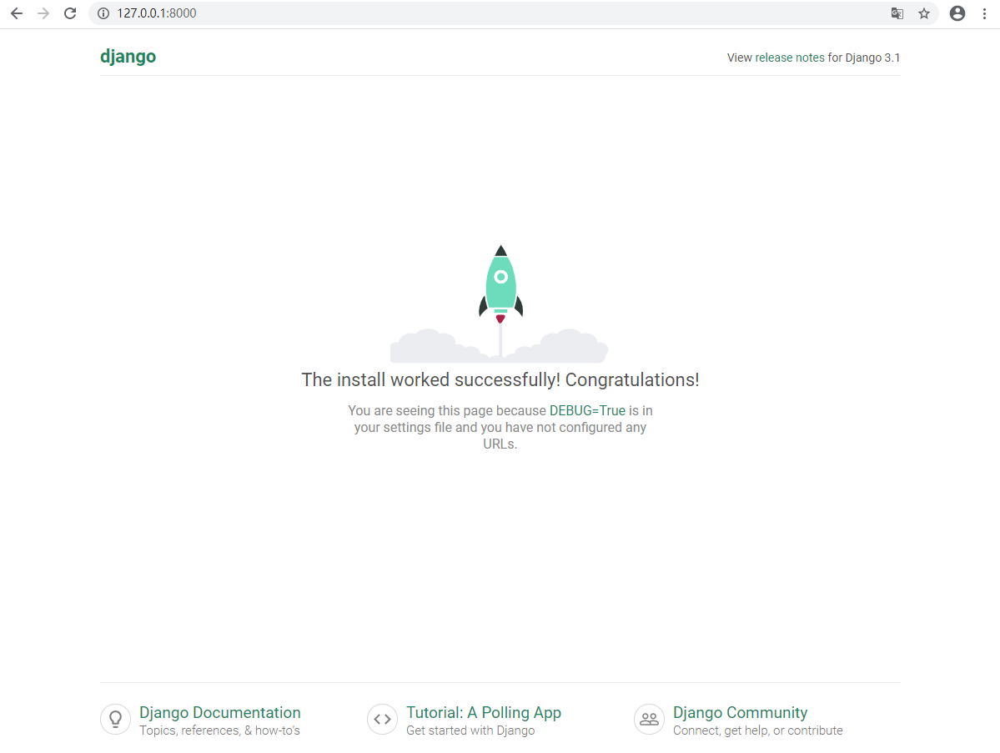

**更换端口**

```
python manage.py runserver 8080
```

**指定监听的ip**

```
# 0是0.0.0.0的简写
python manage.py runserver 0:8080
```

**什么情况下runserver会自动重载python代码？**

- 用于开发的服务器在需要的情况下会对每一次的访问请求重新载入一遍 Python 代码
- 然而，一些动作，比如添加新文件，将不会触发自动重新加载，需要手动重启服务器。


## 三、创建投票应用

### 1. 创建一个应用

在manage.py所在目录下，运行以下命令创建一个应用

```
# 创建一个叫polls的应用
python manage.py startapp polls
```

在这个目录下创建了一个polls目录，目录结构如下

```
polls/
    __init__.py
    admin.py
    apps.py
    migrations/
        __init__.py
    models.py
    tests.py
    views.py
```

### 2. 编写视图

Django视图的概念：**一类具有相同功能和模板的网页的集合**

投票应用中需要插件的视图：

- 问题索引页——展示最近的几个投票问题。
- 问题详情页——展示某个投票的问题和不带结果的选项列表。
- 问题结果页——展示某个投票的结果。
- 投票处理器——用于响应用户为某个问题的特定选项投票的操作。

URLconf将URL模式映射到视图，使视图和URL关联起来。

**创建视图**：打开polls/views.py

```python
# ***** mysite/polls/views.py *****


from django.http import HttpResponse


def index(request):
    return HttpResponse("Hello, world. You're at the polls index.")
```

**映射URL**

在polls目录中新建一个urls.py文件（这个文件在官方文档中被称为URLconf）

```python
# ***** mysite/polls/urls.py *****

from django.urls import path
from . import views

urlpatterns = [
    path('', views.index, name='index')
]
```

在mysite/mysite/urls.py中指定刚才创建的polls.urls模块

```python
# ***** mysite/mysite/urls.py *****

from django.contrib import admin
from django.urls import include, path

urlpatterns = [
    path('polls/', include('polls.urls')),
    path('admin/', admin.site.urls),
]
```

函数 include() 允许引用其它 URLconfs。每当 Django 遇到 include() 时，它会截断与此项匹配的 URL 的部分，并将剩余的字符串发送到 URLconf 以供进一步处理。**（官方文档原文，我没看懂，大概意思应该是执行mysite/mysite/urls.py时，遇到include时，自动跳到mysite/polls/urls.py去处理吧）**

函数 path() 具有四个参数，两个必须参数：route 和 view，两个可选参数：kwargs 和 name。

- route
- view
- kwargs  任意个关键字参数可以作为一个字典传递给目标视图函数（官方文档中没有使用这一特性）
- name  


**验证是否成功添加视图**

```
python manage.py runserver
```

访问http://ip:8000/polls/

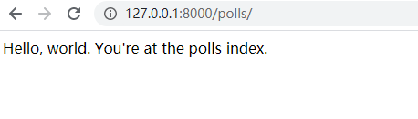

**编写更多视图**（这一部分内容在官方文档中应该是 正式编写视图 部分的，我给插入到这来了）

向mysite/polls/views.py里添加视图

```python
# ***** mysite/polls/views.py *****

from django.shortcuts import render
from django.http import HttpResponse

# Create your views here.


...


def detail(request, question_id):
    return HttpResponse("You're looking at question {}".format(question_id))


def results(request, question_id):
    response = "You're looking at question %s"
    return HttpResponse(response % question_id)


def vote(request, question_id):
    return HttpResponse("You're voting on question %s." %question_id)
```

把新加的视图，添加进mysite/polls/urls.py，添加几个url()函数调用

```python
# ***** mysite/polls/urls.py *****

from django.urls import path
from .import views

urlpatterns = [
    # /polls/
    path("", views.index, name="index"),
    # /polls/5/
    path("<int:question_id>/", views.detail, name='detail'),
    # /polls/5/results/
    path("<int:question_id>/results/", views.results, name='results'),
    # /polls/5/vote/
    path("<int:quesiton_id>/vote/", views.vote, name="vote"),
]
```

运行

```
python manage.py runserver
```

浏览器访问

```
http://127.0.0.1:8000/polls/1/
http://127.0.0.1:8000/polls/1/results/
http://127.0.0.1:8000/polls/1/vote/
```

请求流程：

1. 客户端访问/polls/34/

2. Django载入mysite.urls，这在mysite/settings.py中的配置项ROOT_URLCONF中设置了

    ```python
    # ***** mysite/settings.py *****
    
    ...
    ROOT_URLCONF = 'mysite.urls'
    ...
    ```

3. Django寻找名为urlpatterns变量并且按序匹配正则表达式，找到匹配项polls/

    ```python
    # ***** mysite/urls.py *****
    
    from django.contrib import admin
    from django.urls import include, path
    
    urlpatterns = [
        path('polls/', include('polls.urls')),
        path('admin/', admin.site.urls),
    ]
    ```

4. 然后切掉匹配的文本，将剩余的文本34/发送至polls.urls做进一步处理


### 3. 数据库配置

> 使用python内置数据库SQLite

编辑项目配置settings.py，先设置TIME_ZONE为现在所在时区

```python
# ***** mysite/settings.py *****
TIME_ZONE = 'Asia/Shanghai'

DATABASES = {
	'default': {
        'ENGINE': 'django.db.backends.sqlite3',
        'NAME': BASE_DIR / 'db.sqlite3',
    }
}
```

- ENGINE   可选值有 
    - django.db.backends.sqlite3
    - django.db.backends.postgresql
    - django.db.backends.mysql
    - django.db.backends.oracle
- NAME   数据库名称。如果你使用 SQLite，数据库将是你电脑上的一个文件，在这种情况下，NAME 应该是此文件完整的绝对路径，包括文件名。默认值 BASE_DIR / 'db.sqlite3' 将把数据库文件储存在项目的根目录。

使用其他数据库还需要添加一些额外配置

- USER
- PASSWORD
- HOST

执行以下命令，创建一些表

```
python manange.py migrate
```

这个 migrate 命令检查 INSTALLED_APPS 设置，为其中的每个应用创建需要的数据表。

> settings.py文件头部的INSTALLED_APPS设置项包括了会在项目中启用的所有Django应用，应用能在多个项目中使用，也可以打包且发布项目，让别人使用它们。
>
> 通常， INSTALLED_APPS 默认包括了以下 Django 的自带应用：
>
> - django.contrib.admin -- 管理员站点， 你很快就会使用它。
> - django.contrib.auth -- 认证授权系统。
> - django.contrib.contenttypes -- 内容类型框架。
> - django.contrib.sessions -- 会话框架。
> - django.contrib.messages -- 消息框架。
> - django.contrib.staticfiles -- 管理静态文件的框架。
>
> 这些应用被默认启用是为了给常规项目提供方便。

### 4. 创建模型

模型即数据库结构设计和附加的其它原数据。

下面创建两个模型：问题Question和选项Choice。通过类来创建创建数据模型，每个模型是django.db.models.Model类的子类。每个字段都是Field类的实例，定义某些Field类需要参数。

- **Class Question**  问题

    两个字段：

    - question_text	问题描述

        charField	字符类型

        max_length	最大长度

    - pub_date    发布时间

        DateTimeField	DateTime类型

        ‘date published’  定义的一个人类可读的名字

- **Class Choice**  选项

    两个字段：

    - choice_text	选项描述

    - votes    当前票数

        IntegerField  整数类型

        default=0 默认值为0

    每个选项属于一个问题

    - ForeignKey(Question, on_delete=models.CASCADE)  外键

        定义了每个Choise对象都关联到一个Question对象

        

```python
# ***** mysite/polls/models.py *****

from django.db import models

class Question(models.Model) :
	question_text = models.CharField(max_legth=200)
    pub_date = models.DateTimeField('date published')


class Choice(models.Model):
    question = models.ForeignKey(Question, on_delete=models.CASCADE)
    choice_text = models.CharField(max_length=200)
    votes = models.IntegerField(default=0)
```

### 5. 激活模型

添加polls应用到mysite/settings.py的INSTALLED_APPS，因为 PollsConfig 类写在文件 polls/apps.py 中，所以它的点式路径是 'polls.apps.PollsConfig'。

```python
# ***** mysite/settings.py *****

INSTALLED_APPS = [
    'polls.apps.PollsConfig',
    'django.contrib.admin',
    'django.contrib.auth',
    'django.contrib.contenttypes',
    'django.contrib.sessions',
    'django.contrib.messages',
    'django.contrib.staticfiles',
]
```

执行命令激活模型

```
python manage.py makemigrations polls
```

> 输出内容
>
> ```
> D:\mysite>python manage.py makemigrations polls
> Migrations for 'polls':
>   polls\migrations\0001_initial.py
>     - Create model Question
>     - Create model Choice
> ```
>
> sqlmigrate可以查看迁移命令会执行那些SQL语句，输出内容与使用的数据库有关。
>
> ```
> D:\mysite>python manage.py sqlmigrate polls 0001
> BEGIN;
> --
> -- Create model Question
> --
> CREATE TABLE "polls_question" ("id" integer NOT NULL PRIMARY KEY AUTOINCREMENT, "question_text" varchar(200) NOT NULL, "pub_date" date
>  NOT NULL);
> --
> -- Create model Choice
> --
> CREATE TABLE "polls_choice" ("id" integer NOT NULL PRIMARY KEY AUTOINCREMENT, "choice_text" varchar(200) NOT NULL, "votes" integer NOT
>  NULL, "question_id" integer NOT NULL REFERENCES "polls_question" ("id") DEFERRABLE INITIALLY DEFERRED);
> CREATE INDEX "polls_choice_question_id_c5b4b260" ON "polls_choice" ("question_id");
> COMMIT;
> ```

makemigrations命令检测对模型文件的修改，并把修改的部分存储为一次迁移，存储在polls/migrations/0001_initial.py。

运行migrate命令，在数据库里创建新定义的模型的数据表:

```
python manage.py migrate
```

migrate选中所有还没有执行的迁移，并应用在数据库上。


> **创建、修改数据模型三部曲**
>
> - **编辑models.py 创建、改变模型**
> - **运行`python manage.py makemigrations`为模型的改变生成迁移文件**
> - **运行`python manage.py migrate`来应用数据库迁移**

### 6. 初试api

输入以下命令进入交互式Python命令行，初始Django创建的各种api

```
python manage.py shell
```

```python
>>> from polls.models import Choice, Question
>>> from django.utils import timezone

>>> Question.objects.all()
<QuerySet []>

>>> q = Question(question_text="What's new?", pub_date=timezone.now())
>>> q.save()
>>> q.id
1

>>> q.question_text
"What's new?"

>>> q.pub_date
datetime.datetime(2020, 12, 14, 10, 12, 55, 462378, tzinfo=<UTC>)

>>> q.question_text = "What's up?"
>>> q.save()

>>> Question.objects.all()
<QuerySet [<Question: Question object (1)>]>
```

给模型添加__str\_\_()方法，条用objects.all()的时候返回更多的细节，再为Question类添加一个自定义方法was_published\_recently()

```python
# ***** mysite/polls/models.py *****

import datetime

from django.db import models
from django.utils import timezone

class Question(models.Model):
	...
	def __str__(self):
		return self.question_text
    
    def was_published_recently(self):
        return self.pub_date >= timezone.now() - datetime.timedelta(days=1)
		
class Choice(models,Model):
	...
	def __str__(self):
		return self.choice_text
```

```
>>> from polls.models import Choice, Question

>>> Question.objects.all()
<QuerySet [<Question: What's up?>]>

>>> Question.objects.filter(id=1)
<QuerySet [Question: What's up?]>

>>> Question.objects.filter(question_text_startswith="What")
<QuerySet [Question: What's up?]>
           
>>> from django.utils import timezone
>>> current_year = timezone.now().year

>>> Question.objects.get(pub_date__year=current_year)
<Question: What' up?>

>>> Question.objects.get(id=2)
Traceback (most recent call last):
           ...
DoesNotExist: Question matching query does not exist.
           
>>> Question.objects.get(pk=1)
<Question: What's up?>
           
>>> q = Question.objects.get(pk=1)
>>> q.was_published_recently()
True
           
>>> q = Question.objects.get(pk=1)
>>> q.choice_set.all()
<QuerySet []>

>>> q.choice_set.create(choice_text='Not much', votes=0)
<Choice: Not much>

>>> q.choice_set.create(choice_text='The sky', votes=0)
<Choice: The sky>

>>> c = q.choice_set.create(choice_text='Just hacking again', votes=0)

>>> c.question
<Question: What's up?>

>>> q.choice_set.all()
<QuerySet [<Choice: Not much>, <Choice: The sky>, <Choice: Just hacking again>]>

>>> q.choice_set.count()
3

>>> Choice.objects.filter(question__pub_date__year=current_year)
<QuerySet [<Choice: Not much>, <Choice: The sky>, <Choice: Just hacking again>]>

>>> c = q.choice_set.filter(choice_text__startswith='Just hacking')
>>> c.delete()
```


### 7. Django管理页面

#### ① 创建管理员账号

执行以下命令

```
python manage.py createsuperuser
```

> ```
> D:\Charramma\git_repositories\Django_learning\mysite>python manage.py createsuperuser
> Username (leave blank to use 'charramma'): admin
> Email address: admin@example.com
> Password:
> Password (again):
> This password is too short. It must contain at least 8 characters.
> This password is too common.
> This password is entirely numeric.
> Bypass password validation and create user anyway? [y/N]: y
> Superuser created successfully.
> 
> ```
>
> 这里我输入的是123456，提示密码复杂度太低

启动djsngo开发服务器

```
python manage.py runserver
```

浏览器访问

http://127.0.0.1:8000/admin/

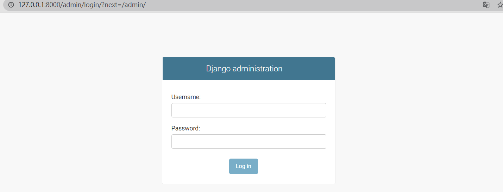

输入用户名和密码进入如下界面

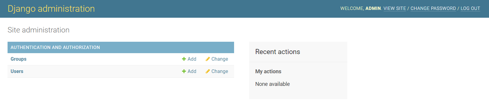

如果要让界面是中文的，在mysite/mysite/settings.py中修改LANGUAGE_CODE变量的值

```python
# ***** mysite/mysite/settings.py *****

...
LANGUAGE_CODE = 'zh-hans'
...
```

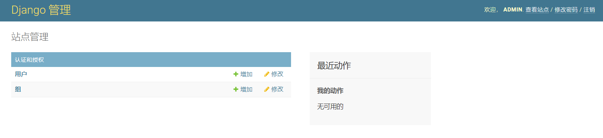

认证和授权应用由django.contrib.auth提供，是Django开发的认证框架

#### ② 向管理页面中加入投票应用

给Question对象一个后台接口

```python
# ***** mysite/polls/admin.py *****

from django.contrib import admin
from .models import Question

admin.site.register(Question)
```

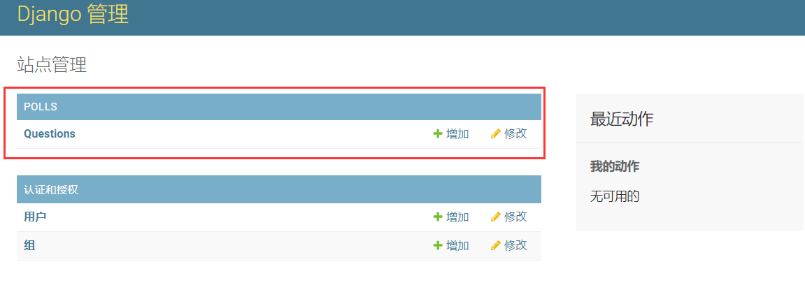

点击Question，会显示数据库中所有的问题Question对象，还可以点击“增加”来添加Question对象

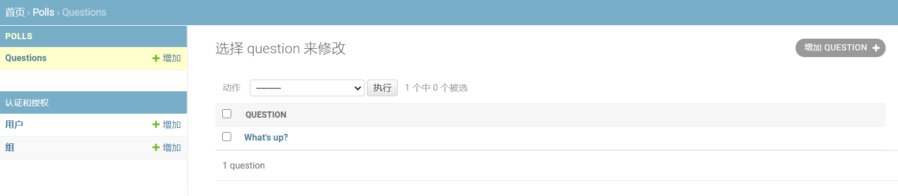

点击“What‘s up?”还可以对现有的Question对象进行编辑。

> 这不比flask方便？

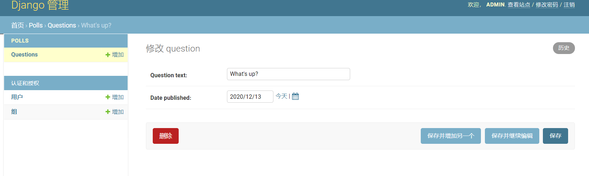

- 表单是从Question模型自动生成

- 不同字段类型会生成对应的HTML输入控件

    > 比如日历控件，我当初辛辛苦苦找控件源码找出来感觉还没这个好看。
    >
    > 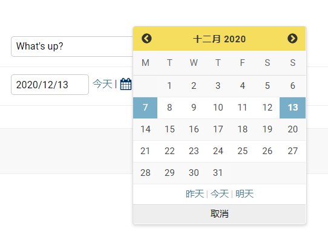

### 8. 正式编写视图 & Django模板templates

**每个视图至少要实现：** **返回一个包含被请求内容的HttpResponse对象** 或 **抛出一个异常（如Http404）**

在mysite/polls/views.py中的index()函数里插入一些新内容，展示数据库里以发布日期排序的最近5个投票问题，以空格分隔（可以把之前在这个py文件里添加的几个视图删掉了，没啥用）

```python
# ***** mysite/polls/views.py *****

from django.http import HttpResponse
from .models import Question

def index(request):
    latest_question_list = Question.objects.order_by('-pub_date')[:5]
    output = ', '.join([q.question_text for q in latest_question_list])
    return HttpResponse(output)
```

此时的页面设计还写死在视图函数的代码中，使用Django的模板系统可以将页面的设计从代码中分离出来。

1. 创建mysite/polls/templates/目录，Django 将会在这个目录里查找模板文件。

    > Django能自动到每个应用目录下寻找templates子目录，是因为mysite/settings.py的TEMPLATES配置项中已经设置好了
    >
    > ```python
    > TEMPLATES = [
    >     {
    >         'BACKEND': 'django.template.backends.django.DjangoTemplates',
    >         'DIRS': [],
    >         'APP_DIRS': True,
    >         'OPTIONS': {
    >             'context_processors': [
    >                 'django.template.context_processors.debug',
    >                 'django.template.context_processors.request',
    >                 'django.contrib.auth.context_processors.auth',
    >                 'django.contrib.messages.context_processors.messages',
    >             ],
    >         },
    >     },
    > ]
    > ```
    >
    > （虽然我没看懂）

2. 在刚刚创建的 templates 目录里，再创建一个目录 polls，然后在其中新建一个文件 index.html 。模板文件的路径应该是 polls/templates/polls/index.html 。因为``app_directories`` 模板加载器是通过上述描述的方法运行的，所以Django可以引用到 polls/index.html 这一模板了。

    > 在polls/templates目录建立一个polls子目录，再把模板文件放到子目录中是为了避免模板文件与另一个应用中的模板文件重名导致Django无法正确区分

    ```html
    # ***** mysite/polls/templates/polls/index.html *****
    
    
        <ul>
        
            <li><a href="/polls/{{ question.id }}/">{{ question.question_text }}</a></li>
        
        </ul>
    
        <p>No polls are available.</p>
    
    ```

3. 重新在mysite/polls/views.py的index视图中使用模板。载入模板mysite/polls/templates/polls/index.html，向它传递一个上下文（context），是一个字典，将模板内的变量映射为Python对象。

    ```python
    # ***** mysite/polls/views.py *****
    
    from django.http import HttpResponse
    from django.template import loader
    
    from .models import Question
    
    def index(request):
        latest_question_list = Question.objects.order_by('-pub_date')[:5]
    
        # 载入模板
        template = loader.get_template('polls/index.html')
        # 填充上下文
        context = {
            'latest_question_list': latest_question_list
        }
        # 返回生成的HttpResponse对象
        return HttpResponse(template.render(context, request))
    ```

4. 访问http://127.0.0.1:8000/polls/

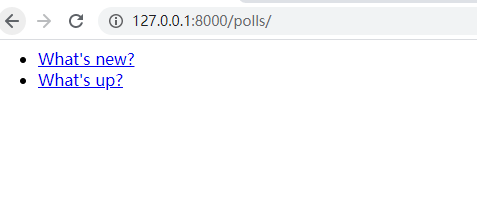

